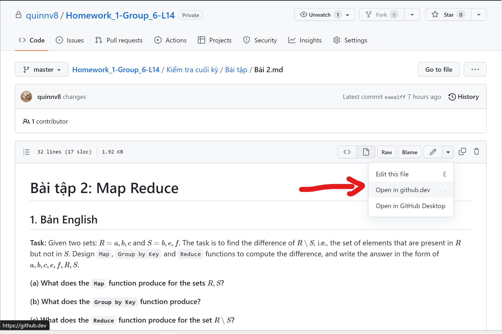
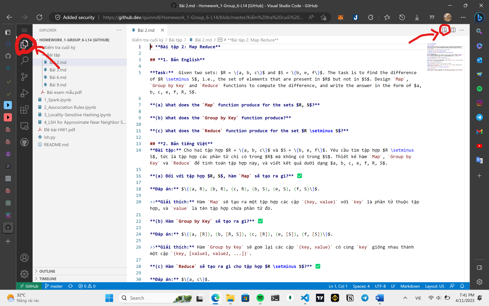
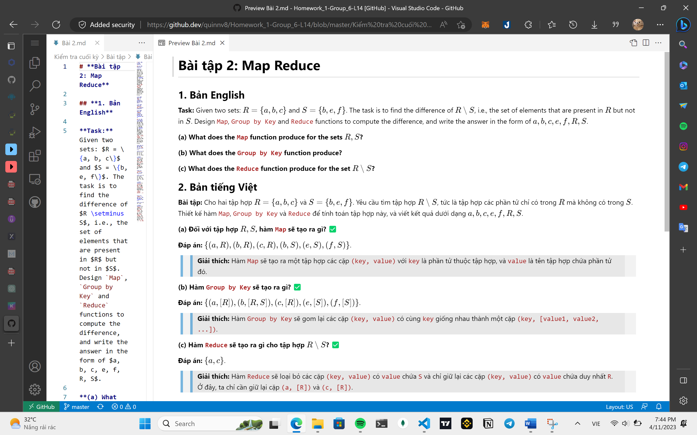

# **Hướng dẫn ghi A4**
- Folder `Kiểm tra cuối kỳ` bao gồm các file `bài tập` và file `lý thuyết`.
- File `bài tập` bao gồm các bài được đánh dấu như sau:
>> + ✅: Là các phần nên ghi trước
>> + ❌: Là các phần nên ghi sau
- Ưu tiên ghi 3 bài `Bài 2.md`, `Bài 6.md`, `Bài 9.md` đầu tiên, vì các bài này là nội dung ôn tập giống lớp sáng.
- Tiếp theo là các phần ✅ trong file `Lý thuyết.md`.
- Cuối cùng là các phần ❌ trong các file. Ưu tiên ghi các phần ❌ trong file `Lý thuyết.md` trước, rồi hẳn đến các phần ❌ trong các file `bài tập` (nếu đủ chỗ trống trong giấy `A4`)
- Ghi chép trên cả `2 mặt` giấy `A4`.

# **Hướng dẫn sử dụng Github**
- Vô link sau để xem hướng dẫn sử dụng Github: [Kiểm tra cuối kỳ](https://github.com/quinnv8/Homework_1-Group_6-L14/tree/master/Ki%E1%BB%83m%20tra%20cu%E1%BB%91i%20k%E1%BB%B3)
- Vô folder `Bài tập` để xem các bài tập.
- Bấm chọn file `Bài 2.md` để xem nội dung bài tập.
- Bấm vào biểu tượng `▼` để chỉnh sửa file như trong hình dưới đây:

- Chọn `Open in github.dev` để chỉnh sửa file trên trình duyệt.
- ✅ Chọn nút bên trái để mở rộng vùng làm việc và nút bên phải để xem được các file `Markdown`. Lý do mình chỉ vậy bởi vì các markdown thể hiện trên Github bị thiếu ký tự và việc mình cần làm là mở nó bằng `Visual Studio Code` để xem được ký tự đầy đủ.

- ✅ Nhớ lia chuột để kéo giãn.

